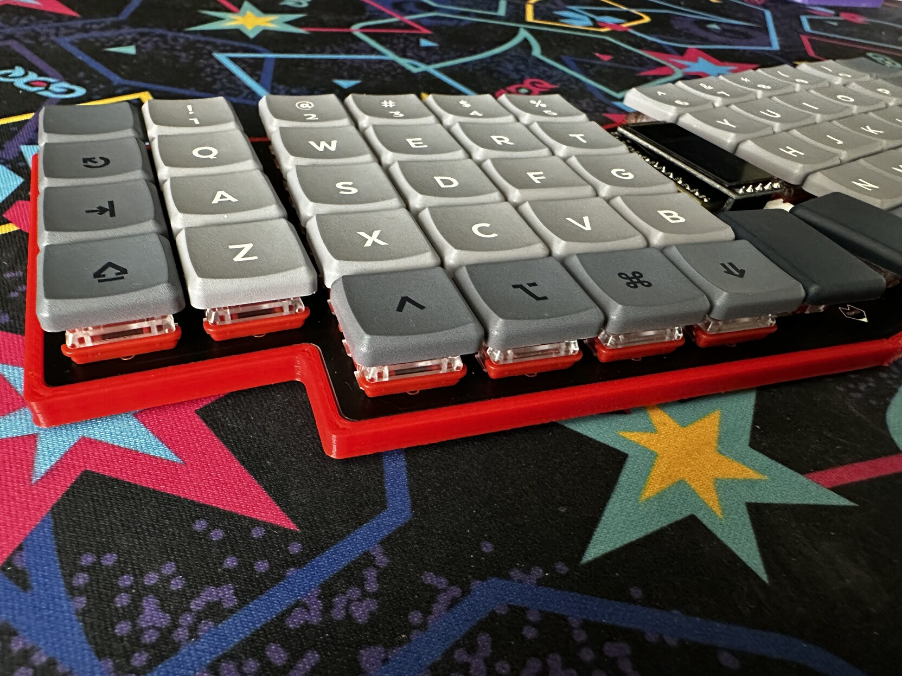
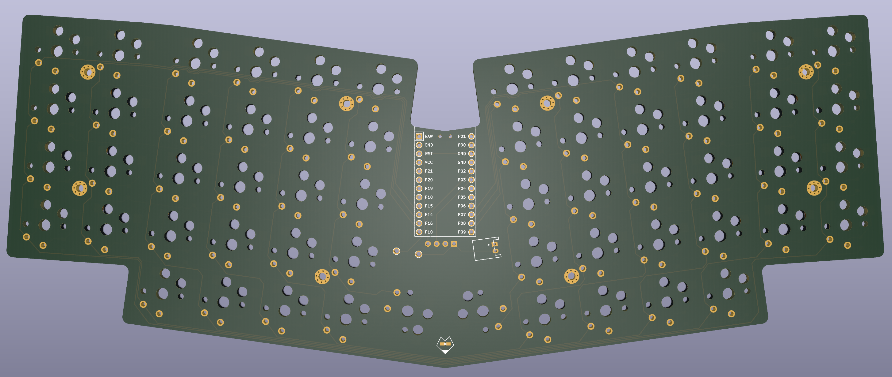
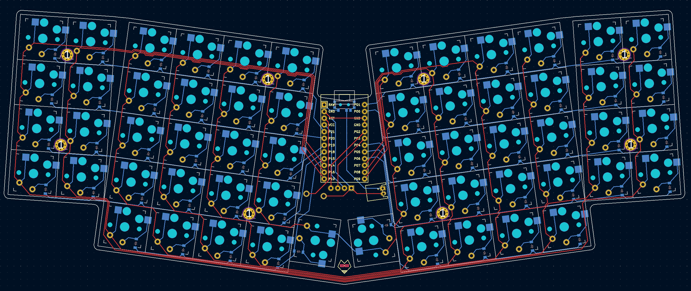
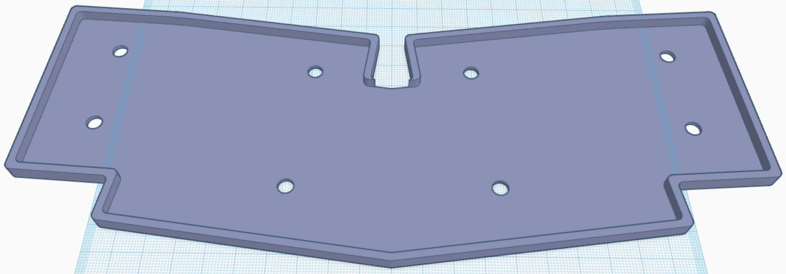
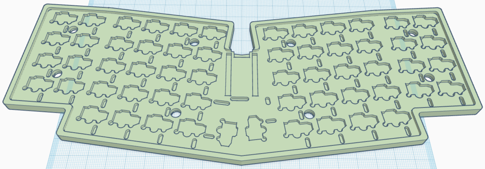
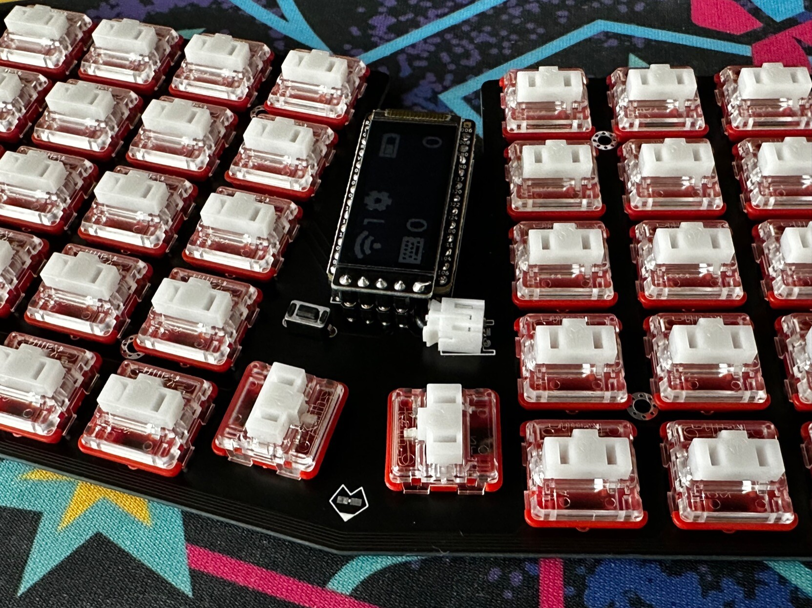

# ChonkV

The ChonkV is a 58 key choc keyboard based off Brickbot's excellent [chocV](https://github.com/brickbots/chocV) keyboard. It adds a number row, an additional outer column, and thumb keys in the style of the [Atreus keyboard](https://shop.keyboard.io/products/keyboardio-atreus).

This keyboard was designed largely as a way of learning the [Ergogen](https://docs.ergogen.xyz) keyboard layout generator software. I was pretty happy with my previous keyboard, the split Sofle Choc, but this new keyboard design allowed me to test a variety of concepts I'd been curious about experimenting with. The ChonkV has the same 58 key count as the Sofle Choc, but its unibody design makes it a bit more portable. This board also has true Choc spacing, and is my first time working with the Nice!Nano wireless microcontroller. While it's not a true ortholinear block, this is my first time dabbling with a board that drops the usual column stagger.

There's a few existing board designs that also may have checked these boxes. The keyboard community has putting out several interesting Reviung variants, and the Atreus also comes close to this design. I've always liked the look of the chocV however, and wanted to try my own spin at the design. This board's not nearly as smol, but I like it. It's chonky. It's a chonky chocV. The ChonkV.

## Features

* 58 key layout featuring number rows, outer columns, three modifiers on each side of the keyboard, raise and lower keys, and Atreus-style thumb keys for enter and space.
* Kailh Choc v1 Switches.
* Supports through-hole switch sholdering or Kailh Choc hotswap sockets.
* Choc switch spacing. (Has been bested with MBK keycaps.)
* Designed for the Nice!Nano wireless Microcontroller.
* Also supports the Nice!View display. (Nice!View requires an additional wire to be run from the display's CS pin to one of the Nice!Nano's extra internal pins.)
* JST battery connector.
* RST pushbutton.
* Physical power switch.
* Includes designs for a Horizon/ChocV style PCB backplate as well as a more traditional 3D printed case.

## Ergogen Files

**Just an FYI for those looking to use this as a reference to learn Ergogen. This library leverages Ergogen 3, and several custom footprints that can be found in [my fork repo](https://github.com/ImStuartJones/ergogen). Ergogen 4 made several breaking changes to the syntax in December of 2022, so make sure you check which version you're using if you reference these config files for your own project.**

### chonkv.yaml

This is the main file for the ChonkV PCB. It is designed with choc spacing, and has a 3mm padding around the edge of the keyboard. The microcontroller is mounted in the middle of the keyboard, along with a reset button and JST header. There's a small bit of PCB art by the thumbs. Running this config file through Ergogen will generate the ChonkV PCB, the board's outlines, as well as some 3D printing .stl case files.

### chonkv_case.yaml

This file was used in the creation of a fairly straightforward keycoard case. It uses 2M standoffs to support the PCB, and gives it a small border outside of the premiter. This config file is seperate from the main chonkv.yaml due to Ergogen limitations on "glue" outlines. It creates an outline that is a few mm larger than the main PCB file.

Unfortunately, since this case design is split between chonkv.yaml and chonkv_case.yaml, Ergogen can't put together all the finished pieces for us. You'll need to import them into some CAD software like TinkerCAD to get the final design output. Or you can just download it from this repo of course.

One thing you may notice is that the whole for the standoffs goes all the way through the 3D model. This is supposed to be a low profile case, so the metal standoffs are designed to sit flush with the bottom of the case.

### chonkv_backplate.yaml

This was a largely failed experiment. The original chocV keyboard included designs for a second inert PCB that would screw onto the bottom of the main PCB to give the board some extra stability and shiled the exposed metal legs of the soldered components. I was always fond of this design, but it was limited to through-hole designs. I came up with some choc hotswap footprints with a cutout for the hotswap sockets, but the resulting cuts were large, complex, and covered most of the board. I haven't tried submitting them to a PCB fab, but I assume they'd try to include an extra charge this backplate. On top of that, the hotswap sockets stick out about 2mm on the bottom of a board, and most PCBs are about 1.8mm thick. I'd like to itterate on this concept some day (or just commit to a through-hole design), but I'm tabling this concept for now.

The backplate design wasn't a complete waste however. I was able to include the backplate design in the 3D printed case I created with chonkv_case.yaml, so the resulting 3D printed case is now a bit more sturdy and less echoy.

## Finished Files

If you don't want to go through the build process yourself, you can always download the files found in the "outputs" folder. It has a zipped Gerbers file, the complex case .stl, and a simplified case .stl. The .stl files have been split into left and right halves in case you have a 3D printer with a smaller print volume.

## Build of Materials

| Part                                      | Amount               | Approx. Price (Total) | Link |
| ----------------------------------------- | -------------------- | --------------------- | ---- |
| ChonkV PCB Fab Via JLCPCB (With Shipping) | 1                    | $28.00 USD (2 Week Shipping) | https://jlcpcb.com |
| Nice!Nano Microcontroller                 | 1                    | $22.00 USD            | https://42keebs.eu/shop/parts/controllers/nice-nano-v2-wireless-controller/ |
| Nice!View Sharp Memory Display            | 1                    | $19.00 USD            | https://42keebs.eu/shop/parts/niceview-power-efficient-lcd-display/ |
| Kailh Choc v2 Switches                    | 6 (58 Keys Total)    | $30.00 USD            | https://42keebs.eu/shop/switches/choc/kailh-choc-low-profile-switches/ |
| 1N4148 Diodes (SMD)                       | 6 (58 Diodes Total)  | $2.00 USD             | https://42keebs.eu/shop/parts/components/1n4148-diodes-through-hole-smd/ |
| Kailh Choc Hotswap Sockets                | 6 (58 Sockets Total) | $10.00 USD            | https://42keebs.eu/shop/parts/kailh-choc-hot-swap-sockets/ |
| Power Switch                              | 1                    | $0.50 USD             | https://42keebs.eu/shop/parts/components/power-switch/ |
| Reset Switch (6x3mm, THD)                 | 1                    | $0.50 USD             | https://42keebs.eu/shop/parts/components/reset-switch/ |
| Mill Max Sockets & Pins                   | 1                    | $7.50 USD             | https://42keebs.eu/shop/parts/components/mill-max-315-sockets-3320-pins-for-pro-micro/ |
| Medium Profile Controller Socket          | 1                    | $0.50 USD             | https://42keebs.eu/shop/parts/components/microcontroller-socket-medium-profile/ |
| Additional Mill Max Pins (For Nice!View)  | 1                    | $3.50 USD             | https://42keebs.eu/shop/parts/components/mill-max-315-sockets-3320-pins-for-pro-micro/ |
| JST Header (2P)                           | 1                    | $4.00 USD             | https://www.aliexpress.us/item/2251832866999242.html |
| Choc v1 Keycaps                           | 1                    | $75.00 USD            | https://mkultra.click/mbk-legend-keycaps/ |
| 100 mAh LiPo Battery (Left Pos.) LP401230 | 1                    | $12.00 USD            | https://www.amazon.com/dp/B0137KTPP0 |

You may be able to get some of the parts cheaper (or at least in bulk) on Aliexpress. 42Keebs has good prices on Nice!Nano and Nice!View microcontrollers, and you can pick up a lot of other parts while you're at it. Batteries you'll need to get domestically, and keycap avalability is subject to change. You should be able to build this keyboard for about $225 USD, give or take some shipping costs.